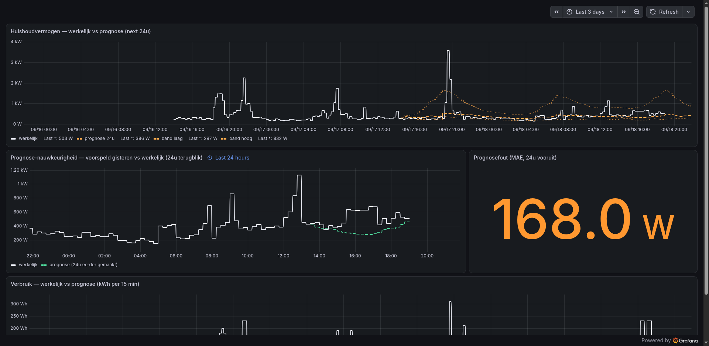

# timesfm-sidecar

Turn an idle Windows gaming PC into a private **time-series forecasting node**
powered by [TimesFM](https://github.com/google-research/timesfm) (Google's
foundation model for forecasting), with strict **gaming priority**: the node's
whole software stack is automatically frozen while the GPU is busy and resumes
when the machine is free again.

Results land in **VictoriaMetrics → Grafana**. A small FastAPI service on the
Windows box is the *only* thing that touches its local storage; clients talk
HTTP with API keys, so sensitive source data never has to live on the node
(the included portfolio client works entirely on ephemeral in-RAM compute).

```
                 ┌────────────────────── Windows gaming PC ──────────────────────┐
 data source ──► │  FastAPI (API keys, scopes, audit)  ──►  TimesFM  ──►  JSON   │
 (HA / prices /  │  watcher: GPU busy? ⇒ ntdll-suspend all node python.exe       │
  anything)      │  hourly job: ingest ⇒ forecast ⇒ push to VictoriaMetrics      │
                 └───────────────────────────────┬───────────────────────────────┘
                                                 ▼
                        VictoriaMetrics ──► Grafana (energy / portfolio dashboards)
```

## Repo layout

| Path | What it is |
|---|---|
| `windows/watcher.ps1` | GPU "gaming priority" watcher (SYSTEM task, ntdll suspend/resume) |
| `windows/install_*.ps1` | schtasks registrations: watcher (boot+logon), API service, hourly job |
| `windows/app/main.py` | FastAPI service: `/health`, `/ingest`, `/series`, `/forecast`, `/forecast/adhoc` (ephemeral), viz page |
| `windows/app/auth.py` | API-key auth (SHA-256 hashed keys), scopes, rate limit, audit log |
| `windows/app/daily_job.py` | hourly loop: ingest → forecast → push to VictoriaMetrics |
| `windows/app/viz.html` | minimal same-origin chart page (optional; Grafana is the primary UI) |
| `windows/app/config.example.json` | node configuration template |
| `clients/portfolio_forecast.py` | laptop-side client: reconstruct portfolio value from public prices, ephemeral forecast, push to VM |
| `clients/csv_forecast.py` | stdlib-only client: forecast any CSV column (or `--demo` synthetic series) via `/forecast/adhoc` |
| `grafana/*.json` | importable dashboards (datasource picker on import) |
| `docs/screenshots/` | dashboard screenshots |

## Quickstart

Already have a node running? Forecast any CSV column with zero client
dependencies:

```bash
python3 clients/csv_forecast.py --demo value --horizon 48 \
    --api-host http://<node-ip>:8000 --api-key tmfm_...
# → prints inference time + forecast head/tail, writes demo_forecast.csv
# add --vm-url http://<victoriametrics>:8428 --metric my_series to graph it
```

Everything goes through `/forecast/adhoc`: computed in RAM, nothing stored on
the node.

## Windows node setup

1. Install OpenSSH server + admin key, set default shell:
   ```powershell
   Add-WindowsCapability -Online -Name OpenSSH.Server~~~~0.0.1.0
   Set-Service sshd -StartupType Automatic
   New-ItemProperty -Path "HKLM:\SOFTWARE\OpenSSH" -Name DefaultShell `
     -Value "C:\Windows\System32\WindowsPowerShell\v1.0\powershell.exe" -PropertyType String -Force
   ```
2. Create `C:\timesfm` (or set `TIMESFM_HOME`), a Python 3.12 venv in
   `$env:TIMESFM_HOME\venv`, and install:
   ```
   pip install timesfm[torch] pandas einops utilsforecast fastapi uvicorn duckdb httpx
   ```
   TimesFM 3.x API: `TimesFM3Forecaster.from_pretrained("google/timesfm-3.0-pytorch", device="cpu")`,
   then `model.predict(context=..., horizon=..., return_quantiles=True)`.
   On pre-RDNA2 AMD GPUs use `device="cpu"` (no ROCm on Windows).
3. Copy `windows/` + `windows/app/` to the node, create `app/config.json` from
   the example, lock its ACL: `icacls config.json /inheritance:r /grant SYSTEM:F /grant Administrators:F`
   The optional `weather` block (`lat`/`lon`) enables temperature covariates:
   hourly outdoor temperature from the free open-meteo API (no key) is aligned
   to the 15-min bucket grid and passed to TimesFM as a `past_future_covariates`
   array; it is also stored/pushed as `home_temp_c{source="open-meteo"}` so you
   can overlay it in Grafana. Any weather failure degrades gracefully to a
   plain forecast.
4. Self-test the suspend/resume mechanics:
   `powershell -File watcher.ps1 -SelfTest`
5. Register everything (from an **admin** session; schtasks System-principal
   tasks need it):
   ```powershell
   powershell -File install_watcher.ps1   # TimesFMWatcher + -Logon (SYSTEM)
   powershell -File install_api.ps1       # TimesFMAPI + -Logon (SYSTEM)
   powershell -File install_job.ps1       # TimesFMJob hourly (SYSTEM)
   schtasks /Run /TN TimesFMAPI
   ```
6. Generate an API key, store its **hash** in `app/api_keys.json`:
   ```json
   { "my-client": { "hash": "<sha256 hex of key>", "scopes": ["read", "forecast", "ingest"] } }
   ```
   Scopes: `read` | `forecast` | `ingest` (keys with all three = admin).
   Plaintext keys live in your password manager, never on the node.
7. Open the API port to your LAN only:
   `netsh advfirewall firewall add rule name="TimesFM API" dir=in action=allow protocol=TCP localport=8000 remoteip=192.168.1.0/24`

## Client setup (portfolio example)

```bash
export PF_API_HOST="http://<node-ip>:8000"
export PF_API_KEY="<plaintext key>"        # or PF_API_KEY_ITEM for a `secret <item>` helper
export PF_VM_URL="http://<victoriametrics>:8428"
export PF_DB_SSH_HOST="<host-with-docker>"  # holdings read via ssh + docker exec psql
python3 clients/portfolio_forecast.py
```

What it does: reads current positions from your DB → fetches public daily
prices (Yahoo; currency-aware via `EURUSD=X`/`GBPEUR=X`) → reconstructs a
value series **locally** → one ephemeral `/forecast/adhoc` call (nothing is
stored on the node) → pushes actuals, forecast, quantile band, per-position
sentiment (`stock_forecast_return_pct`, `stock_forecast_signal`) and accuracy
metrics to VictoriaMetrics.

A systemd user timer makes it daily:
```ini
[Timer]
OnCalendar=Mon..Fri *-*-* 19:00:00
Persistent=true
```

## Grafana

Import `grafana/*.json`, pick your Prometheus/VictoriaMetrics datasource at
import time. Metrics produced:

| Metric | Meaning |
|---|---|
| `home_power_watts{entity,kind}` / `home_energy_kwh{entity,kind}` | energy actual / forecast / band_low / band_high |
| `home_power_watts_mae24` | 24h-horizon mean absolute error (accuracy) |
| `home_temp_c{source}` | outdoor temperature (open-meteo) used as forecast covariate |
| `portfolio_value_eur{kind}` | portfolio value actual / forecast / band |
| `portfolio_value_eur_forecast_last`, `_mae7` | 30d-ahead point forecast, 7d-horizon MAE |
| `stock_forecast_return_pct{symbol}`, `stock_forecast_signal{symbol}` | per-position expected return and ±threshold signal |

> **Forecast lines are pushed time-ALIGNED (ending at "now")** — see gotcha #1.

## Security model

- The FastAPI service is the only process that opens the node's local DB;
  clients never touch storage, only the HTTP API (hashed keys, scopes, rate
  limit, JSONL audit log).
- `/forecast/adhoc` computes on arrays in RAM and persists nothing — suitable
  for sensitive data (e.g. portfolio values) that must not touch the node.
- Node-side secrets (`ha_token`, `job_token`) live in `config.json` with a
  SYSTEM/Admins-only ACL. Plaintext API keys never live on the node.
- API port is LAN-only via firewall rule; put a TLS proxy in front if you need
  more.

## Hard-won gotchas (read before debugging)

1. **VictoriaMetrics hides future-stamped samples** — they are accepted on
   write but invisible (even to `/api/v1/export`) until wall time passes them.
   Hence time-aligned forecast curves.
2. **Home Assistant history API**: silently truncates long windows — fetch in
   1-day chunks; a trailing `/` before the query string 404s; `.local` names
   resolve to mDNS IPv6 link-local from Windows — use IPv4.
3. **Grafana `instant` queries** through the Prometheus datasource can come
   back empty where range queries work — panels use range + dense sample
   trails; `reduce` transformations must set `includeTimeField: false` inside
   `options`.
4. **Windows quirks**: PS 5.1 has no `&&`; single-quoted PS strings don't
   expand variables in schtasks `/TR`; detached `Start-Process` dies with the
   sshd session (use scheduled tasks); `WORKGROUP\<user>` isn't a valid task
   trigger principal — use `COMPUTERNAME\<user>` or SYSTEM.
5. **The gaming account** on such machines is often an auto-login user that
   isn't yours — run the watcher/API/job as SYSTEM so they work regardless of
   who is logged in, and so cross-user suspend works.
6. **DuckDB is single-writer** — one process owns the file. Conveniently this
   matches the security model.
7. **Gaming detection**: max `engtype_3D` GPU-engine utilization, 6×10s above
   threshold = gaming; 12×10s below = idle again. Video playback won't trigger
   it (VideoDecode engines are ignored).
8. **TimesFM covariates**: `past_only_covariates` must be `(C, len(context))`,
   `past_future_covariates` must be `(C, len(context) + horizon)` — the future
   half is what the model actually conditions on. Both are `atleast_2d`-ed and
   NaN-linearly-interpolated internally. Weather covariates need hourly source
   data spanning the whole context *and* horizon (open-meteo `past_days=8,
   forecast_days=8` covers both).
9. **`schtasks /End` often fails to kill detached processes** — the API task
   can look "stopped" while an old python still binds :8000, and the next
   start dies with `WinError 10048`. Find the stale listener by PID:
   `netstat -ano | findstr :8000 | findstr LISTENING` then `taskkill /F /PID <pid>`.

## Screenshots


